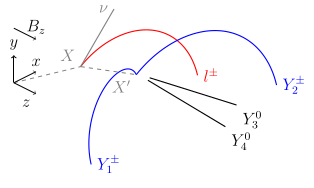
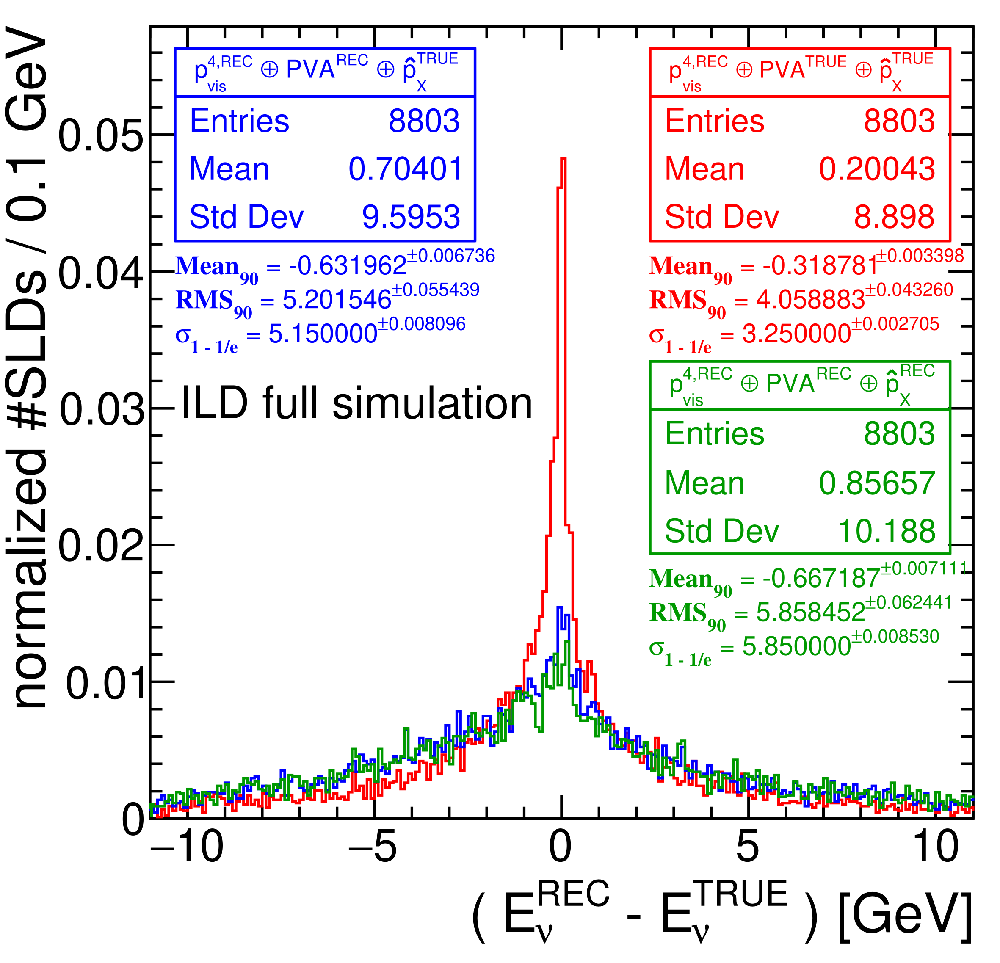

#  SLDCorrection: A Marlin processor to correct neutrino energy from semi-leptonic decays of bottom and charmed hadrons
Please cite [arXiv:2105.08480](https://arxiv.org/abs/2105.08480) if you use this package

Author:

Yasser Radkhorrami <yasser.radkhorrami@desy.de>

## Brief description:

Use this Marlin processor to correct the missing four-momenta of neutrinos from semi-leptonic decays of bottom and charmed hadrons. For the time being, only semi-leptonic decays of bottom hadron in b-jets are corrected, but only when there is no further semi-leptonic decay in the jet. In the future improvements, semi-leptonic decays of charmed hadrons in b- and c-jets will be included. The four-momentum of the neutrino is calculated from the kinematics of the semi-leptonic decay and is obtained up to a sign ambiguity. The main output of the processor is a set of LCCollection including:

- SemiLeptonicDecayVertex: Name of the Vertex collection containes vertex or vertices of the semi-leptonic decays(s)
- SemiLeptonicDecayVertexRP: Name of the Reconstructed Particle collection associated to SemiLeptonicDecayVertex
- ReconstructedNeutrino: Name of the Reconstructed Particle collection containing all solutions for each semi-leptonic decay.

The position of SemiLeptonicDecayVertex represents the point that the semi-leptonic decay occurs. SemiLeptonicDecayVertexRP contains all particle that associated to the vertex of the semi-leptonic decay. The first associated particle is the zero-solution for the neutrino. The second particle is the corresponding charged lepton and the remaining particles are added by the same sequence of the association. A detailed explanation for the neutrino-correction can be found in [arXiv:2105.08480](https://arxiv.org/abs/2105.08480)

## Detailed description:
In addition to main 3 output LCCollections, LCRelation collections are also created to find the semi-leptonic decay(s) in each jet, find the possible solutions of each semi-leptonic decay and find the true neutrino in the MCParticle collection. In a pragmatic approach to correct the jet energy (or four-momentum) using SLDCorrection, one needs to find the semi-leptonic decay(s) in the jet using JetSLDLinkName collection. This gives the vertex (or vertices) of the semi-leptonic decay(s) in the jet. Then neutrino solutions of the semi-leptonic decay are found using NuSLDLinkName collection. In order to test with the true parameters of the semi-leptonic decay, recoNumcNuLinkName collection Gives the link of the reconstructed neutrino to the true neutrino in the MCParticle collection.

### Reconstructed of the neutrino four-momentum:

Evaluating the method is possible by using the true information as input to the correction. The processor parameters that determine the input is cheated or used from reconstructed information are:

- cheatLepton4momentum: Four-momentum of corresponding charged lepton.
- cheatFlightDirection: Flight direction of the parent hadron
- cheatPVAcharged: Association of charged decay products
- cheatCharged4momentum: Four-momentum of charged decay products
- cheatPVAneutral: Association of neutral decay products
- cheatNeutral4momentum: Four-momentum of neutral decay products

There are two main possibilities of the reconstruced charged lepton that the semi-leptonic decay can be corrected:

- charged lapton is associated to a secondary vertex

- charged lepton is a single track but another vertex exist in the jet

In all other cases of the charged lepton, the correction for the semi-leptonic decay can not be used.

When charged or neutral decay products are associated using reconstructed information (cheatPVAcharged/cheatPVAneutral = false) The angle of association cone and also the invariant mass of associated particles should be determined in processor parameters

- when charged lapton is associated to a secondary vertex

chargedCosAcceptanceAngleSLD4 = 0.5, BSLDChargedSLD4InvMassCut = 1.80 GeV, BSLDNeutralSLD4InvMassCut = 2.8 GeV

- charged lepton is a single track but another vertex exist in the jet

chargedCosAcceptanceAngleSLD5 = 0.5, BSLDChargedSLD5InvMassCut = 1.50 GeV, BSLDNeutralSLD5InvMassCut = 2.5 GeV

### Induced Errors due to Correction:

The uncertainties due to correction are evaluated using the reconstructed energy and direction of the neutrino:

- energy uncertainty of the reconstructed neutrino

- direction uncertainty of the reconstructed neutrino

Green histograms are used to estimate the overall uncertainty due to neutrino correction. In the case that partial cheting of input parameters, the parameters of the corresponding histograms should be used

sigmaAlphaNu = 0.100 rad , sigmaENu = 4.0 GeV

In the end, neutrinos are assumed to be massless and sigmaAlphaNu and sigmaENu are transformed to a covariance matrix in (p,E) space.